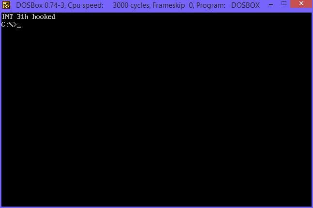
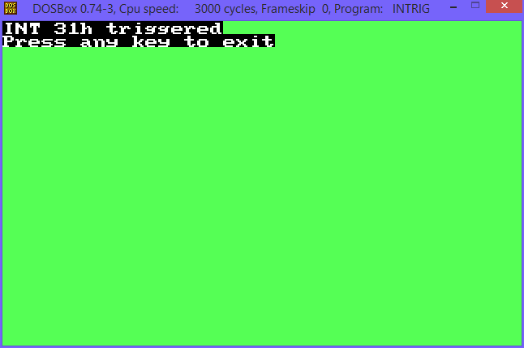

# Assembly Custom Interrupt
Custom interrupt maker for DOS written in x86 assembly languance.

## What are interrupts?
Interrupts are functions defined in Interrupt Vector Table, which is table of interrupts resident in your RAM.

### Output:

